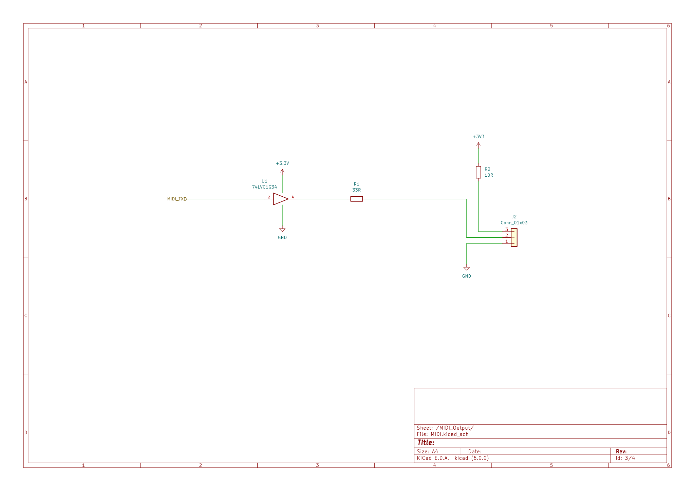

# MIDIPresetController

This is the doc for the [hardware project files](KicadProject)

This project has the following dependencies to [KicadLibrary](HW/KicadLibrary):

- BATTERY/GenericCoinCellHolders/GenericCoinCellHolders

## Schematic 

1. System

2. Input 

3. MCU

4. Output

## Pinout 

## PCB

1. Front

2. Back

